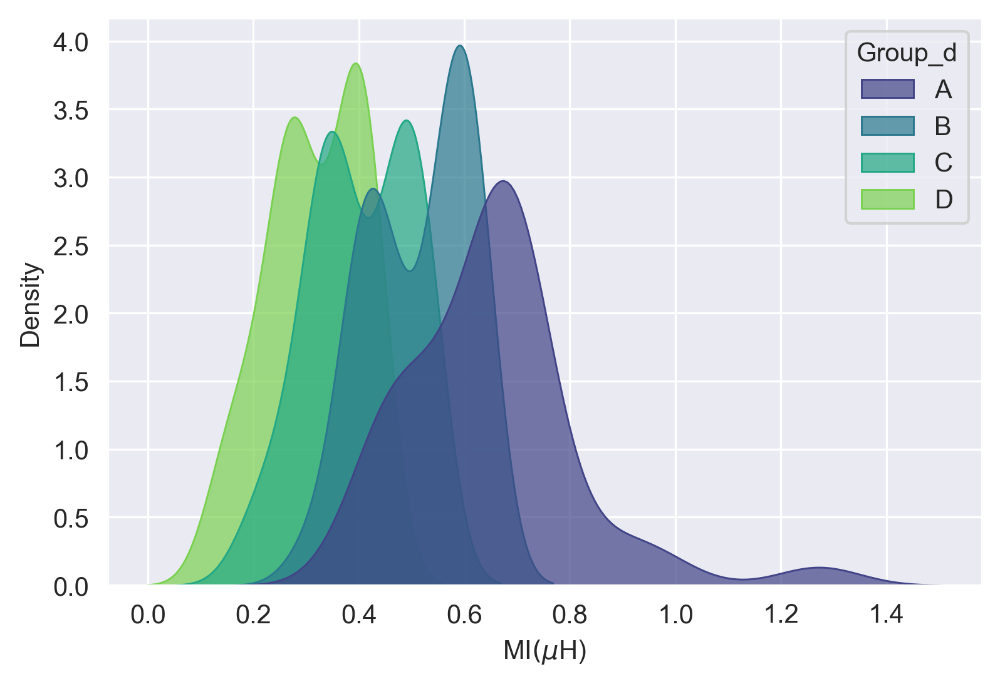
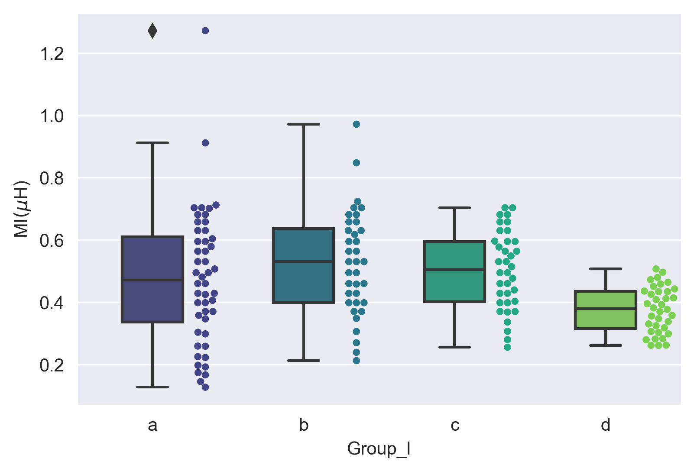
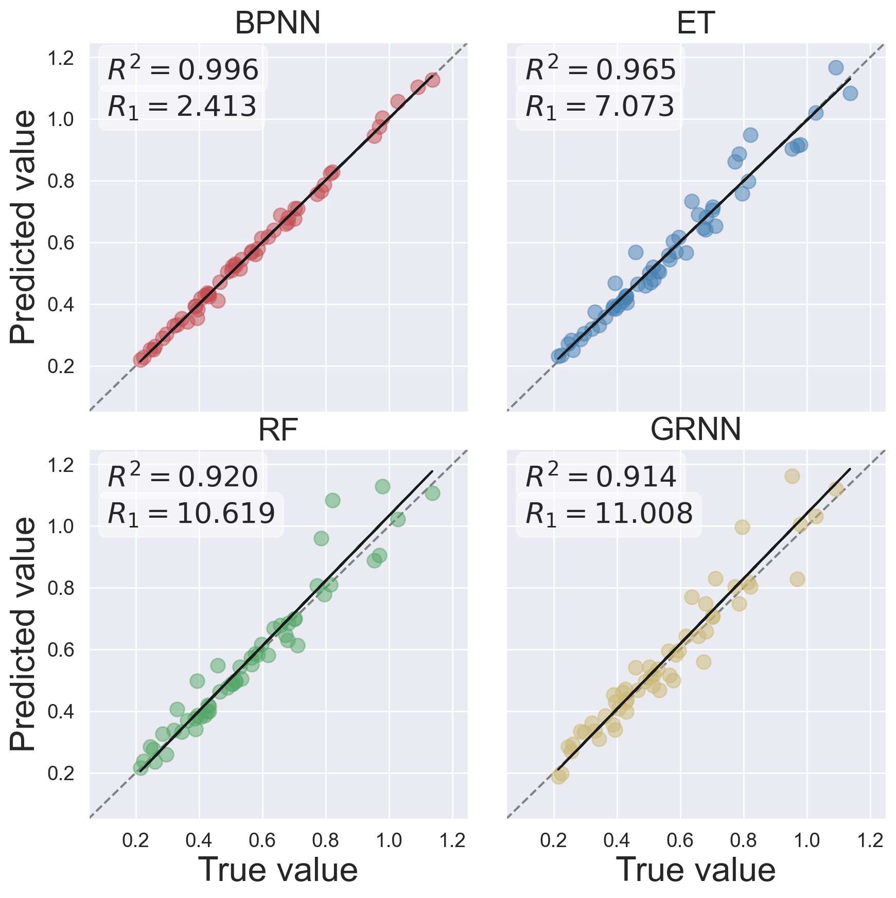
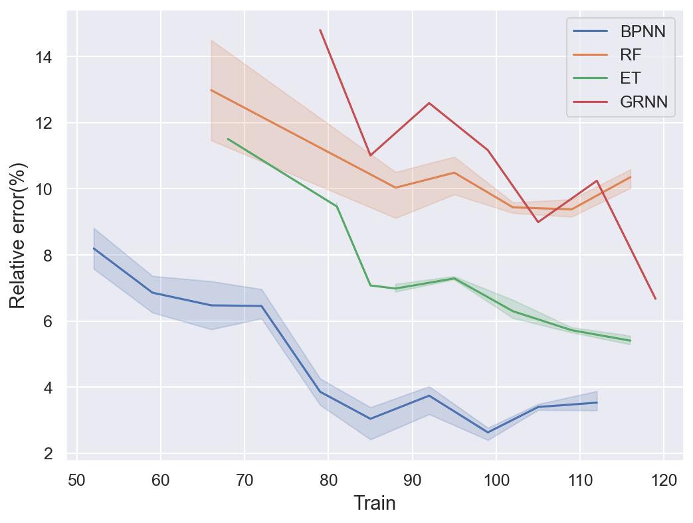

# Project description

This project is a simple case of using different machine learning methods to solve a regression problem, including BPNN(Back Propagation Neural Network), RF(Random forest), ET (Extra-tree) and GRNN [Generalized Regression Neural Network](https://github.com/muhendis/Generalized-regression-neural-networks-library-from-scratch).

# File description

## For data preparing

`data_preprocess.ipynb` is used to draw the data distribution, in which provide two figures, one is the density and the other is the violin figure. 

## For Modeling

`BPNN/GRNN/ET/RF.ipynb` are different algorithm used for the modeling;

## For result

`result_each_model.ipynb` is used to draw the regression picture of results from four algorithms in test set.

`Draw results lines.ipynb` is used to draw the figure which shows the effect of different ratio of train/test set. 

